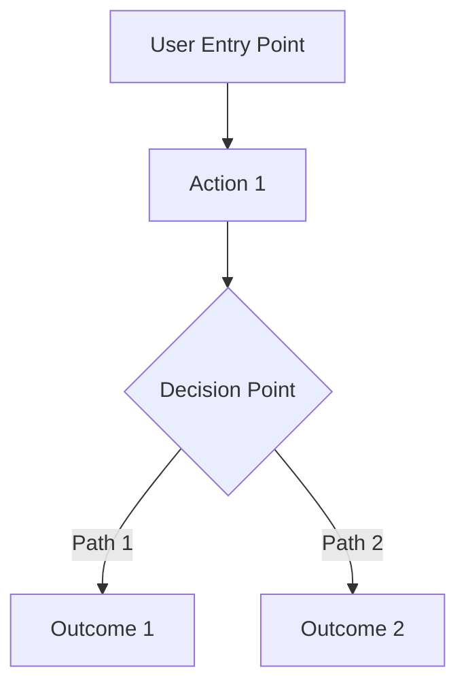

# PRD: [Feature Name]

> **AI-Human Collaborative PRD Template**  
> This template is designed for PRDs created through the AI-assisted workflow with human validation at each phase.

## Document Metadata

| Field              | Value                                  |
| ------------------ | -------------------------------------- |
| **Author**         | [Human Product Owner]                  |
| **AI Assistance**  | Claude Code / [AI Agent Used]          |
| **Creation Date**  | [Date]                                 |
| **Last Updated**   | [Date]                                 |
| **Status**         | [Draft/Review/Approved/In Development] |
| **Stakeholders**   | [List of reviewers and approvers]      |
| **Priority**       | [P0/P1/P2/P3]                          |
| **Target Release** | [Version/Date]                         |

## Executive Summary

> **AI Generated, Human Validated**  
> Brief overview of the feature, problem solved, and expected impact.

### Key Points

- **Problem**: [One sentence problem statement]
- **Solution**: [One sentence solution overview]
- **Impact**: [Expected business/user impact]
- **Effort**: [High-level effort estimate]

---

## Phase 1: Problem Definition

> **Source**: AI Problem Analysis Agent + Human Validation

### Core Problem Statement

**Problem Description**:
[Detailed description of the user problem this feature addresses]

**Target User Personas**:

- **Primary**: [Main user type affected]
- **Secondary**: [Other user types that benefit]

**Current State Pain Points**:

1. [Specific pain point 1]
2. [Specific pain point 2]
3. [Specific pain point 3]

**Problem Validation**:

- [ ] User research conducted (surveys/interviews)
- [ ] Problem quantified with current metrics
- [ ] Competitive analysis completed
- [ ] Stakeholder alignment achieved

### Success Metrics

**Primary KPIs**:

- [Metric 1]: [Baseline] → [Target] ([% change])
- [Metric 2]: [Baseline] → [Target] ([% change])

**Secondary Metrics**:

- [Supporting metric 1]: [Target]
- [Supporting metric 2]: [Target]

**Measurement Plan**:

- **Tracking Method**: [How metrics will be collected]
- **Review Frequency**: [How often metrics will be reviewed]
- **Success Timeline**: [When success will be evaluated]

---

## Phase 2: Solution Design

> **Source**: AI Solution Design Agent + Human Technical Review

### Proposed Solution Overview

**High-Level Approach**:
[Summary of the technical approach and user experience]

**Key Components**:

1. [Component 1]: [Purpose and functionality]
2. [Component 2]: [Purpose and functionality]
3. [Component 3]: [Purpose and functionality]

**Solution Validation**:

- [ ] Technical feasibility confirmed
- [ ] Architecture review completed
- [ ] Resource availability verified
- [ ] Integration impact assessed

### User Experience Flow



**Key User Journeys**:

1. **[Journey 1]**: [Step-by-step user flow]
2. **[Journey 2]**: [Step-by-step user flow]

---

## Phase 3: Detailed Requirements

> **Source**: AI Requirements Specification Agent + Human Validation

### Functional Requirements

#### Core Features

**[Feature 1]: [Feature Name]**

- **Description**: [What this feature does]
- **User Story**: As a [user type], I want [goal] so that [benefit]
- **Acceptance Criteria**:
  - [ ] [Specific, testable criterion 1]
  - [ ] [Specific, testable criterion 2]
  - [ ] [Specific, testable criterion 3]
- **Priority**: [Must Have/Should Have/Nice to Have]

**[Feature 2]: [Feature Name]**

- **Description**: [What this feature does]
- **User Story**: As a [user type], I want [goal] so that [benefit]
- **Acceptance Criteria**:
  - [ ] [Specific, testable criterion 1]
  - [ ] [Specific, testable criterion 2]
- **Priority**: [Must Have/Should Have/Nice to Have]

#### Edge Cases & Error Handling

**Error Scenarios**:

1. **[Error Type 1]**:

   - **Trigger**: [What causes this error]
   - **Expected Behavior**: [How system should respond]
   - **User Communication**: [What user sees/does]

2. **[Error Type 2]**:
   - **Trigger**: [What causes this error]
   - **Expected Behavior**: [How system should respond]
   - **User Communication**: [What user sees/does]

**Data Edge Cases**:

- **Empty States**: [How to handle when no data exists]
- **Large Data Sets**: [Performance considerations and limits]
- **Invalid Data**: [Validation and sanitization approach]

### Non-Functional Requirements

**Performance Requirements**:

- Page load time: < [X] seconds
- API response time: < [X] milliseconds
- Concurrent users: Support [X] simultaneous users
- Data processing: Handle [X] items per operation

**Security Requirements**:

- Authentication: [Required auth level]
- Authorization: [Permission model]
- Data Privacy: [PII handling requirements]
- Input Validation: [Validation requirements]

**Accessibility Requirements**:

- WCAG compliance level: [AA/AAA]
- Keyboard navigation: [Requirements]
- Screen reader support: [Requirements]
- Mobile responsiveness: [Requirements]

---

## Phase 4: Technical Implementation

> **Source**: AI Solution Design Agent + Human Technical Validation

### Architecture Overview

**Technology Integration**:

- **Frontend**: Next.js components with [specific patterns]
- **Backend**: Server Actions + Repository pattern
- **Database**: Prisma schema changes required: [Yes/No]
- **External APIs**: [List any external service dependencies]

**Data Model Changes**:

```prisma
// New models or schema changes
model [NewModel] {
  // Field definitions
}

// Modifications to existing models
model [ExistingModel] {
  // New fields
}
```

**API Design**:

```typescript
// Server Actions
export const [actionName] = authorizedActionClient
  .inputSchema(
    z.object({
      // Validation schema
    })
  )
  .action(async ({ ctx, parsedInput }) => {
    // Implementation approach
  });
```

### Integration Points

**Existing Feature Dependencies**:

- **[Feature 1]**: [How this feature integrates]
- **[Feature 2]**: [Data/functionality shared]
- **[Feature 3]**: [UI integration points]

**External Service Integration**:

- **Steam API**: [Usage and fallback strategy]
- **IGDB API**: [Data requirements and caching]
- **Analytics**: [Tracking implementation]

### Performance Considerations

**Optimization Strategy**:

- **Database**: [Query optimization, indexing strategy]
- **Frontend**: [Rendering optimization, code splitting]
- **Caching**: [What to cache and cache invalidation strategy]
- **Monitoring**: [Performance metrics to track]

---

## Phase 5: Testing Strategy

> **AI Generated Test Scenarios + Human Test Plan Validation**

### Test Coverage Plan

**Unit Tests**:

- [ ] Utility functions (100% coverage)
- [ ] Server actions (90% coverage)
- [ ] Component logic (85% coverage)

**Integration Tests**:

- [ ] Database operations
- [ ] API integrations
- [ ] Cross-feature interactions

**End-to-End Tests**:

- [ ] Critical user journeys
- [ ] Error scenarios
- [ ] Performance benchmarks

### Test Scenarios

**Positive Test Cases**:

1. **[Scenario 1]**: [User action] → [Expected result]
2. **[Scenario 2]**: [User action] → [Expected result]

**Negative Test Cases**:

1. **[Error Scenario 1]**: [Invalid input] → [Expected error handling]
2. **[Error Scenario 2]**: [System failure] → [Expected fallback behavior]

**Performance Tests**:

- Load testing with [X] concurrent users
- Stress testing with [X] data volume
- Response time validation under normal load

---

## Phase 6: Risk Assessment

> **AI Risk Analysis + Human Risk Evaluation**

### Technical Risks

| Risk     | Likelihood     | Impact         | Mitigation Strategy   | Owner    |
| -------- | -------------- | -------------- | --------------------- | -------- |
| [Risk 1] | [High/Med/Low] | [High/Med/Low] | [Mitigation approach] | [Person] |
| [Risk 2] | [High/Med/Low] | [High/Med/Low] | [Mitigation approach] | [Person] |

### Business Risks

| Risk     | Likelihood     | Impact         | Mitigation Strategy   | Owner    |
| -------- | -------------- | -------------- | --------------------- | -------- |
| [Risk 1] | [High/Med/Low] | [High/Med/Low] | [Mitigation approach] | [Person] |
| [Risk 2] | [High/Med/Low] | [High/Med/Low] | [Mitigation approach] | [Person] |

### Rollback Plan

**Rollback Triggers**:

- [Specific condition that would trigger rollback]
- [Performance threshold breach]
- [Error rate threshold]

**Rollback Process**:

1. [Step 1 of rollback procedure]
2. [Step 2 of rollback procedure]
3. [Communication plan during rollback]

---

## Phase 7: Implementation Plan

### Development Timeline

| Phase        | Tasks       | Duration  | Dependencies   | Owner         |
| ------------ | ----------- | --------- | -------------- | ------------- |
| **Sprint 1** | [Task list] | [X weeks] | [Dependencies] | [Team/Person] |
| **Sprint 2** | [Task list] | [X weeks] | [Dependencies] | [Team/Person] |
| **Sprint 3** | [Task list] | [X weeks] | [Dependencies] | [Team/Person] |

### Milestone Checkpoints

**Milestone 1: [Name]** - [Date]

- [ ] [Deliverable 1]
- [ ] [Deliverable 2]
- **Success Criteria**: [How to measure milestone completion]

**Milestone 2: [Name]** - [Date]

- [ ] [Deliverable 1]
- [ ] [Deliverable 2]
- **Success Criteria**: [How to measure milestone completion]

### Resource Requirements

**Development Team**:

- Frontend Developer: [X] weeks
- Backend Developer: [X] weeks
- Database Engineer: [X] weeks
- QA Engineer: [X] weeks

**External Dependencies**:

- [Dependency 1]: [Timeline and owner]
- [Dependency 2]: [Timeline and owner]

---

## Phase 8: Launch Strategy

### Rollout Plan

**Phase 1: Internal Testing** ([Date Range])

- Team testing and feedback
- Performance validation
- Bug fixes and refinements

**Phase 2: Beta Users** ([Date Range])

- Limited user group ([X] users)
- Feedback collection and iteration
- Metrics validation

**Phase 3: Full Launch** ([Date])

- All users have access
- Full monitoring and support
- Success metrics tracking

### Success Criteria

**Launch Success Metrics** (30 days post-launch):

- Feature adoption: [X]% of active users
- User satisfaction: [X]/5 rating
- Error rate: < [X]%
- Performance: Meet SLA requirements

**Go/No-Go Criteria**:

- [ ] All critical bugs resolved
- [ ] Performance meets requirements
- [ ] Security review completed
- [ ] Documentation completed
- [ ] Support team trained

---

## Appendices

### Appendix A: AI Agent Outputs

**Requirement Discovery Agent Results**:

- [Link to or summary of AI-generated requirements]
- Key insights and suggestions used

**Solution Design Agent Results**:

- [Link to or summary of AI-generated technical design]
- Architecture decisions influenced by AI recommendations

**Requirements Specification Agent Results**:

- [Link to or summary of AI-generated detailed requirements]
- Test scenarios generated by AI

### Appendix B: User Research

**Research Methods Used**:

- User interviews: [X] participants
- Surveys: [X] responses
- Analytics analysis: [Date range and key findings]

**Key Findings**:

1. [Finding 1 with supporting data]
2. [Finding 2 with supporting data]

### Appendix C: Competitive Analysis

| Competitor     | Feature Comparison | Strengths   | Weaknesses   | Opportunities   |
| -------------- | ------------------ | ----------- | ------------ | --------------- |
| [Competitor 1] | [Comparison]       | [Strengths] | [Weaknesses] | [Opportunities] |
| [Competitor 2] | [Comparison]       | [Strengths] | [Weaknesses] | [Opportunities] |

### Appendix D: Technical Specifications

**Detailed API Specifications**:

```typescript
// Complete API interface definitions
```

**Database Schema Details**:

```sql
-- Complete schema changes with indexes and constraints
```

---

## Document Changelog

| Version | Date   | Changes                  | Author              |
| ------- | ------ | ------------------------ | ------------------- |
| 1.0     | [Date] | Initial PRD creation     | [AI + Human Author] |
| 1.1     | [Date] | [Description of changes] | [Author]            |

---

## Approval Sign-offs

| Role                    | Name   | Status     | Date | Comments |
| ----------------------- | ------ | ---------- | ---- | -------- |
| **Product Owner**       | [Name] | ⏳ Pending | -    | -        |
| **Tech Lead**           | [Name] | ⏳ Pending | -    | -        |
| **Engineering Manager** | [Name] | ⏳ Pending | -    | -        |
| **Design Lead**         | [Name] | ⏳ Pending | -    | -        |

**Final Approval**: ⏳ Pending

---

_This PRD was created using the AI-assisted workflow documented in `documentation/ai-assisted-prd-workflow.md`. Each section represents a collaboration between AI agents and human validation to ensure comprehensive, technically feasible, and business-aligned requirements._
