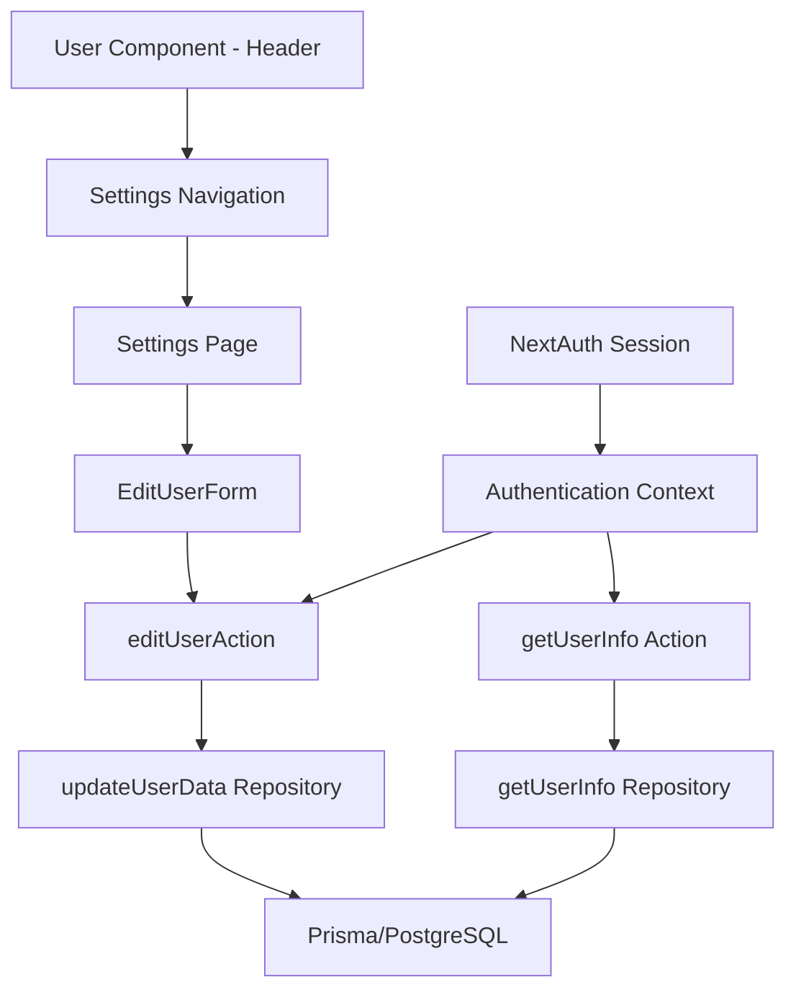

# Manage User Info Feature

This feature provides comprehensive user profile management capabilities for the PlayLater gaming platform, enabling users to view, edit, and manage their profile information while ensuring secure integration with OAuth authentication providers.

## Feature Overview and Purpose

The Manage User Info feature serves as the central hub for user account management, providing:

- **Profile Information Display**: View OAuth-provided data (name, email) and user-customizable fields
- **Profile Editing**: Update username and Steam profile URL with real-time validation
- **Navigation Integration**: Header dropdown for easy access to settings and sign-out functionality
- **Authentication Integration**: Seamless integration with NextAuth.js session management
- **Steam Integration Support**: Optional Steam profile URL management for enhanced platform features

### Key Business Value

- Enables personalized user experience through customizable profiles
- Supports Steam ecosystem integration for enhanced gaming features
- Provides secure profile management with OAuth provider data protection
- Maintains user engagement through intuitive account management workflows

## Architecture and Component Breakdown

### Directory Structure

```
features/manage-user-info/
├── components/
│   ├── edit-user-form.tsx    # Profile editing form component
│   └── user.tsx              # Header dropdown user component
├── server-actions/
│   ├── edit-user-action.ts   # Profile update server action
│   ├── get-user-info.ts      # User data retrieval server action
│   └── index.ts              # Server actions exports
├── lib/
│   └── validation.ts         # Form validation schemas (legacy)
├── index.ts                  # Feature exports
├── PRD.md                    # Product requirements document
└── CLAUDE.md                 # This documentation file
```

### Component Architecture

#### 1. User Component (`components/user.tsx`)

**Purpose**: Header dropdown for user navigation and account access
**Location**: Used in `/shared/components/header.tsx` (line 112)

**Key Features**:

- Avatar display with image fallback to initials (lines 40-48)
- Dropdown menu with Settings and Sign Out options (lines 51-60)
- NextAuth session integration for user state management (line 32)
- Memoized component for performance optimization (line 31)

**React Patterns**:

- Uses `memo()` for performance optimization
- Custom `getFirstTwoLiterals()` utility for avatar fallbacks (lines 21-29)
- NextAuth `useSession()` hook for authentication state

#### 2. EditUserForm Component (`components/edit-user-form.tsx`)

**Purpose**: Form interface for editing user profile information
**Location**: Used in `/app/user/settings/page.tsx` (line 55)

**Key Features**:

- Read-only OAuth fields (name, email) with conditional rendering (lines 49-60)
- Editable username field with default value population (lines 61-64)
- Form submission with loading states and toast notifications (lines 35-42)
- Type-safe props interface with comprehensive user data structure (lines 23-32)

**React Patterns**:

- `useAction()` hook from next-safe-action for server action integration
- `useFormStatus()` for form state management in SubmitButton
- Toast notifications using Sonner for user feedback
- Controlled form inputs with default values from server data

## Data Flow Architecture

### Client → Server Actions → Repository → Database



### 1. Data Retrieval Flow

**Server Action**: `getUserInfo` (`server-actions/get-user-info.ts`)

- Uses `authorizedActionClient` for authentication requirement (lines 6-10)
- Calls repository layer `getUserInfoCommand` (line 12)
- Returns user profile data with error handling (lines 14-18)

**Repository**: `getUserInfo` in `/shared/lib/repository/user/user-repository.ts` (lines 81-93)

- Prisma query with specific field selection for security
- Selected fields: id, name, username, steamProfileURL, steamConnectedAt, email

### 2. Data Update Flow

**Server Action**: `editUserAction` (`server-actions/edit-user-action.ts`)

- Form data validation using `zfd.formData()` schema (lines 14-19)
- Authorized action with user context injection (lines 9-12)
- Repository call with validated data (lines 21-25)
- Cache revalidation for settings page (line 27)

**Repository**: `updateUserData` in `/shared/lib/repository/user/user-repository.ts` (lines 95-108)

- Direct Prisma update with username and steamProfileURL fields
- User ID scoping for security

### 3. Authentication Integration

- NextAuth session management throughout the flow
- `authorizedActionClient` ensures authenticated access to server actions
- Session data provides user context for all operations

## TypeScript Patterns and Type Definitions

### 1. Component Props Types

```typescript
// EditUserForm props (lines 23-32 in edit-user-form.tsx)
type EditUserFormProps = {
  userInfo: {
    name: string | null;
    username: string | null;
    steamProfileURL: string | null;
    steamConnectedAt: Date | null;
    email: string | null;
    id: string;
  };
};
```

### 2. Repository Types

Located in `/shared/lib/repository/user/types.ts`:

```typescript
// UpdateUserDataInput type (lines 17-21)
export type UpdateUserDataInput = {
  userId: string;
  username: string | null;
  steamProfileUrl: string | null;
};
```

### 3. Form Validation Schema

```typescript
// Server action input schema (lines 14-19 in edit-user-action.ts)
zfd.formData({
  username: zfd.text(),
  steamProfileUrl: zfd.text().optional(),
});
```

### 4. Type Safety Patterns

- `next-safe-action` for type-safe server actions with validation
- Prisma-generated types for database operations
- Strict null checks for optional fields (steamProfileURL, name, email)
- Zod schema validation for runtime type checking

## Key Files and Their Responsibilities

### Server Actions Layer

1. **`server-actions/get-user-info.ts`**

   - Retrieves complete user profile data
   - Enforces authentication requirements
   - Error handling for missing users

2. **`server-actions/edit-user-action.ts`**
   - Handles profile updates with validation
   - Form data parsing and sanitization
   - Cache revalidation after updates

### Component Layer

1. **`components/user.tsx`**

   - Header navigation dropdown
   - Avatar display with fallbacks
   - Authentication state management
   - Navigation to settings and sign-out functionality

2. **`components/edit-user-form.tsx`**
   - Profile editing interface
   - Form validation and submission
   - Loading states and user feedback
   - Separation of read-only and editable fields

### Integration Points

1. **`/app/user/settings/page.tsx`**

   - Main settings page container
   - Tabbed interface for different setting categories
   - Integration with manage-integrations feature

2. **`/shared/components/header.tsx`**
   - User component integration in global navigation
   - Responsive design patterns
   - Authentication-aware rendering

## Testing Strategy

### Unit Testing Approach

**Test File**: `server-actions/edit-user-action.server-action.test.ts`

**Coverage Areas**:

1. **Authentication Testing** (lines 14-23)

   - Unauthenticated access prevention
   - Proper error message return for auth failures

2. **Validation Testing** (lines 25-37)

   - Input type validation (string vs number)
   - Validation error structure verification
   - Field-specific error messages

3. **Success Path Testing** (lines 39-102)
   - Username update functionality
   - Steam profile URL update functionality
   - Repository function call verification
   - Proper data transformation

### Testing Patterns

- Mock-based testing with Vitest
- `vi.mocked()` for dependency mocking
- Repository layer mocking for isolated unit tests
- Comprehensive error case coverage
- Success and failure path validation

### Test Data Structures

```typescript
// Mock user data structure (lines 43-55)
{
  id: "test-user-id",
  username: "test",
  email: "test@example.com",
  name: "Test User",
  emailVerified: null,
  image: null,
  steamProfileURL: null,
  steamId64: null,
  steamUsername: null,
  steamAvatar: null,
  steamConnectedAt: null,
}
```

## Integration Points with Other Features

### 1. Authentication System (`NextAuth.js`)

- Session management for user state
- OAuth provider data handling
- Sign-out functionality integration

### 2. Steam Integration (`features/steam-integration`)

- Steam profile URL management
- Connection status tracking
- Integration preparation for Steam data import

### 3. Theme Toggle (`features/theme-toggle`)

- Header component integration
- Shared navigation space

### 4. Manage Integrations (`features/manage-integrations`)

- Tabbed interface sharing in settings page
- Complementary account management features

### 5. Global Navigation (`shared/components/header`)

- User component integration
- Responsive navigation patterns
- Authentication state display

## Security Considerations

### 1. Authentication Requirements

- All server actions require authenticated sessions
- User data is scoped to authenticated user ID only
- OAuth provider data remains read-only and protected

### 2. Input Validation

- Server-side validation using Zod schemas
- Form data sanitization through `zod-form-data`
- Type-safe input processing

### 3. Data Privacy

- User profile data isolation
- No cross-user data access
- Optional Steam profile URL (user-controlled)

## Performance Optimizations

### 1. Component Optimizations

- `memo()` wrapper for User component to prevent unnecessary re-renders
- Conditional rendering for optional user data fields
- Efficient avatar fallback generation

### 2. Data Loading

- Server-side data fetching in settings page
- Cache revalidation after profile updates
- Selective field querying in repository layer

### 3. Form Handling

- Real-time form status tracking
- Optimistic UI updates with loading states
- Toast notifications for immediate user feedback

## Legacy Code Notes

### Unused Validation File

**File**: `lib/validation.ts`

- Contains legacy validation schema that's no longer used
- Current validation is handled in server actions using `zfd.formData()`
- Consider removing this file in future cleanup

### Areas for Future Enhancement

1. **Steam Profile URL Validation**: Add URL format validation
2. **Avatar Upload**: Implement custom avatar upload functionality
3. **Enhanced Profile Fields**: Add bio, location, or other profile customization
4. **Profile Privacy Settings**: Implement visibility controls for profile data

This feature demonstrates well-architected user profile management with proper separation of concerns, type safety, and secure authentication integration within the PlayLater application ecosystem.
